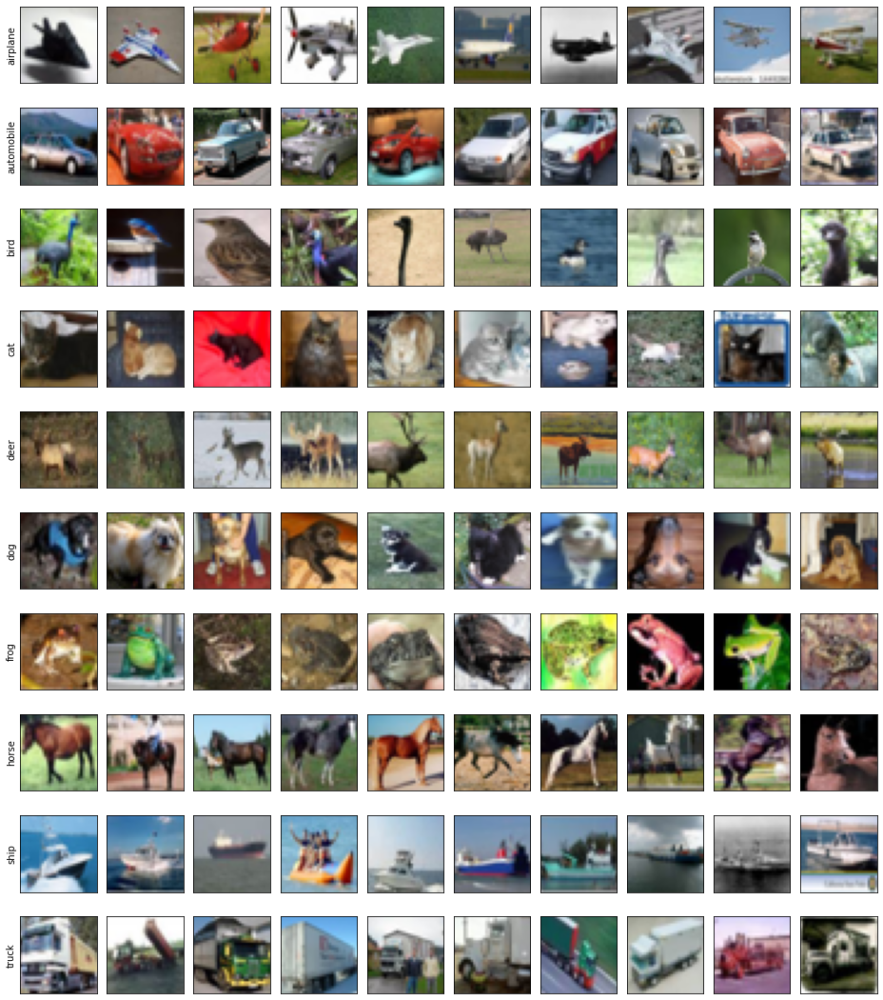

# ciFAIR-10 Dataset

ciFAIR is a variant of the popular CIFAR dataset, which uses a slightly modified test set avoiding near-duplicates between training and test data.
It comprises RGB images of size 32x32 spanning 10 of everyday objects for ciFAIR-10.

CIFAR homepage: <https://www.cs.toronto.edu/~kriz/cifar.html>  
CIFAR paper: <https://www.cs.toronto.edu/~kriz/learning-features-2009-TR.pdf>

ciFAIR homepage: <https://cvjena.github.io/cifair/>  
ciFAIR Paper: <https://arxiv.org/abs/1902.00423>

## :card_index_dividers: Splits

We provide the following splits of the ciFAIR-10 dataset for testing small-data performance:

|   Split      | Total Images | Images / Class |
|:-------------|-------------:|---------------:|
| train{i}     |  300 / 3,000 |             30 |
| val{i}       |  200 / 2,000 |             20 |
| trainval{i}  |  500 / 5,000 |             50 |
| fulltrain    |       50,000 |    5,000 / 500 |
| test0        |       10,000 |    1,000 / 100 |

`fulltrain` and `test0` correspond to the original data.
`train{i}` comprises a subset of 30 training images from each class and `val` 20 more.
`trainval{i}` is a combination of both.
The value of `i` ranges in {0,1,2}.

## ⚙️ Usage

This dataset can be loaded using `gem.datasets.ciFAIR10`.
These data loaders will automatically download the data into the data directory if it is not present.
The dataset identifier is `"cifair10"`.
