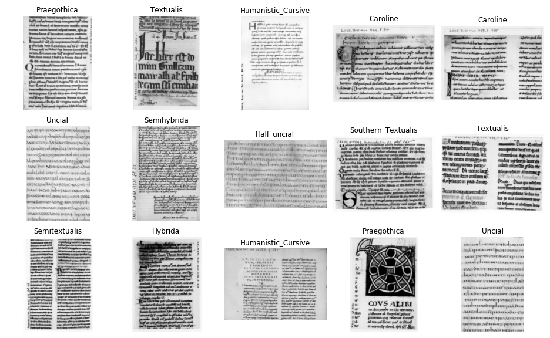

# Classification of Latin Medieval Manuscripts

The Classification of Latin Medieval Manuscripts (CLaMM) database was used in the ICFHR2016 Competition for Script Classification.
The task to be evaluated in the competition was the classification of 1000 images of Latin Scripts, from handwritten books dated 500 C.E. to 1600 C.E.

Dataset homepage: <https://clamm.irht.cnrs.fr/icfhr2016-clamm/icfhr2016-clamm/>  
Paper: <https://journal.digitalmedievalist.org/articles/10.16995/dm.61/>

## :inbox_tray: Obtaining the data

The bash script `download_data.sh` provided in this directory can be used to download the actual image data.
Doing so will result in a folder `images` containing tif gray-scale images of Latin scripts.

## 🗂️ Splits

We provide the following splits of the dataset for testing small-data performance:

|   Split      | Total Images | Images / Class |
|:-------------|-------------:|---------------:|
| train{i}     |          360 |             30 |
| val{i}       |          240 |             20 |
| trainval{i}  |          600 |             50 |
| test0        |         1000 |          68-90 |

The value of `i` ranges in {0,1,2}.
Note that the test set is slightly imbalanced.
Therefore, balanced accuracy should be used to assess performance instead of plain accuracy.

## ⚙️ Usage

This dataset can be loaded using `gem.datasets.CLaMMDataset`.
The dataset identifier is `"clamm"`.

