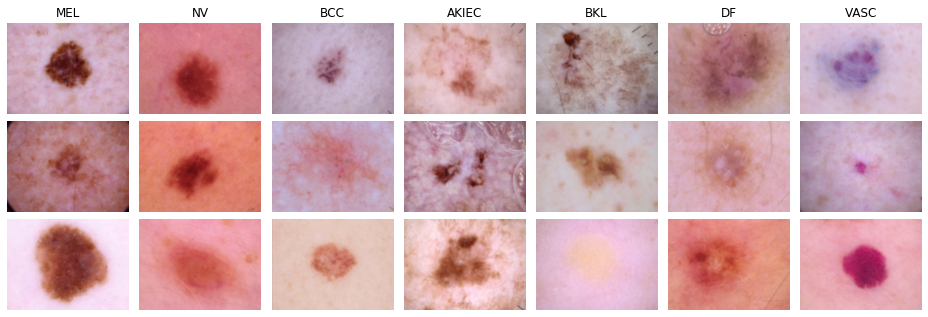

# ISIC 2018 Skin Lesion Classification Dataset

The _International Skin Imaging Collaboration (ISIC) 2018 Challenge_ comprises 10,015 dermoscopic skin lesion images, annotated with one of seven possible skin disease types.

Dataset homepage: <https://challenge.isic-archive.com/landing/2018/47>  
Paper: <https://arxiv.org/abs/1902.03368>

## 📥 Obtaining the data

The bash script `download_data.sh` provided in this directory can be used to download the actual image data and original annotations.
Doing so will result in a folder `ISIC2018_Task3_Training_Input` containing the images and a file `ISIC2018_Task3_Training_GroundTruth.csv` with the original annotations.

## 🗂️ Splits

The original dataset is imbalanced, so we created the following non-exhaustive but balanced splits:

|   Split      | Total Images | Images / Class |
|:-------------|-------------:|---------------:|
| train{i}     |          350 |             50 |
| val{i}       |          210 |             30 |
| trainval{i}  |          560 |             80 |
| test{i}      |        1,944 |         35-400 |

The value of `i` ranges in {0,1,2}.
Note that the test sets are still imbalanced.
Therefore, balanced accuracy should be used to assess performance instead of plain accuracy.

## ⚙️ Usage

This dataset can be loaded using `gem.datasets.ISIC2018Dataset`.
The dataset identifier is `"isic2018"`.
